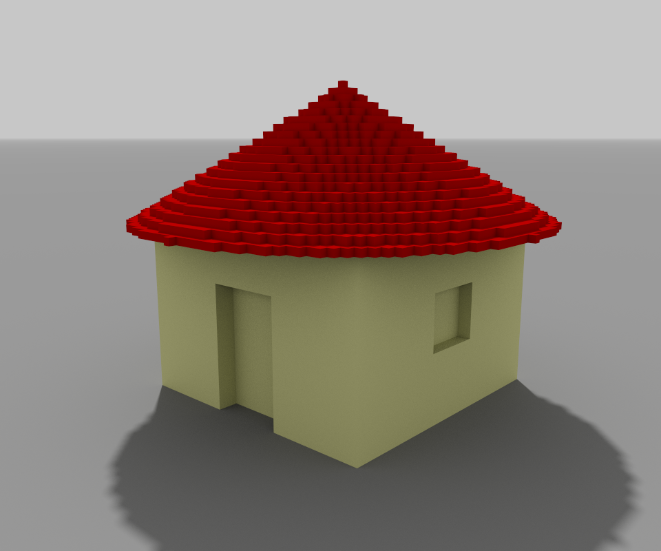
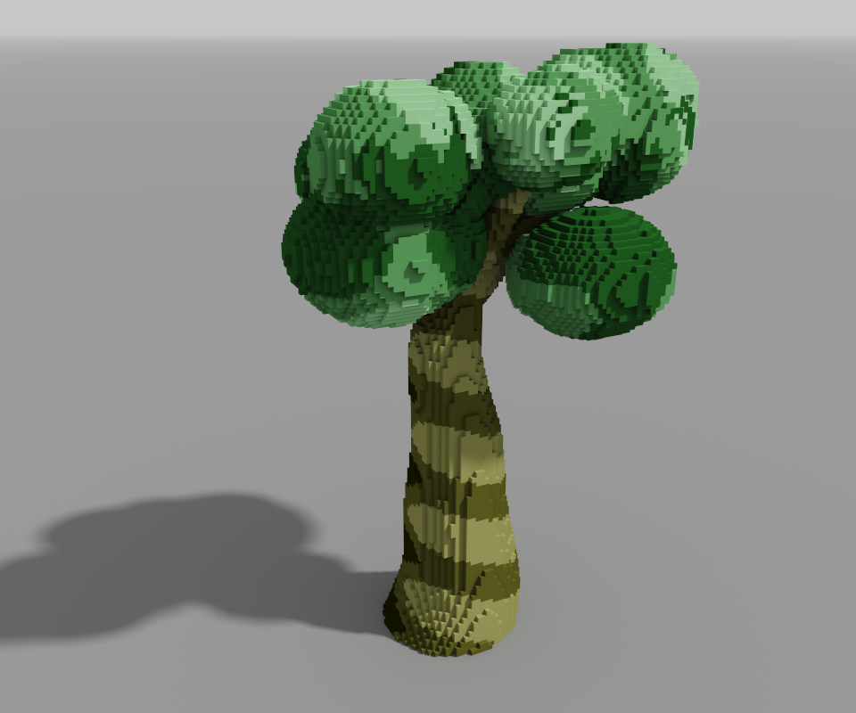
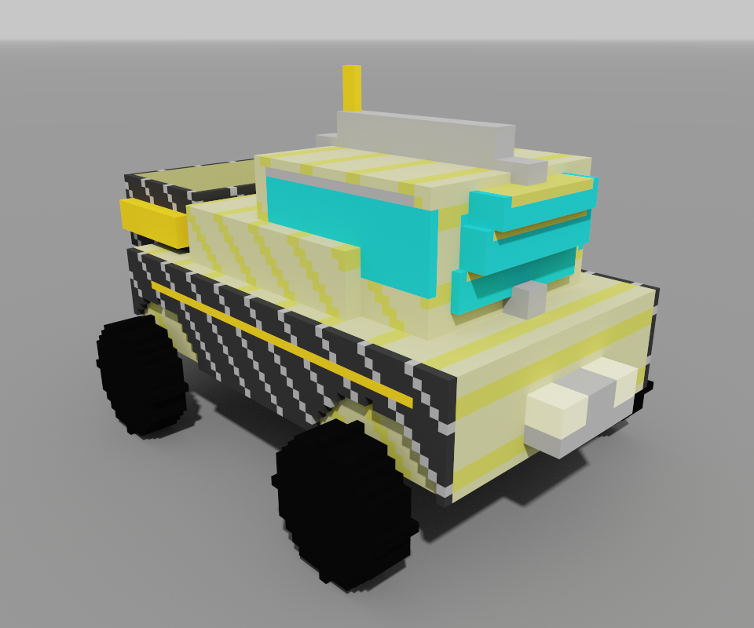
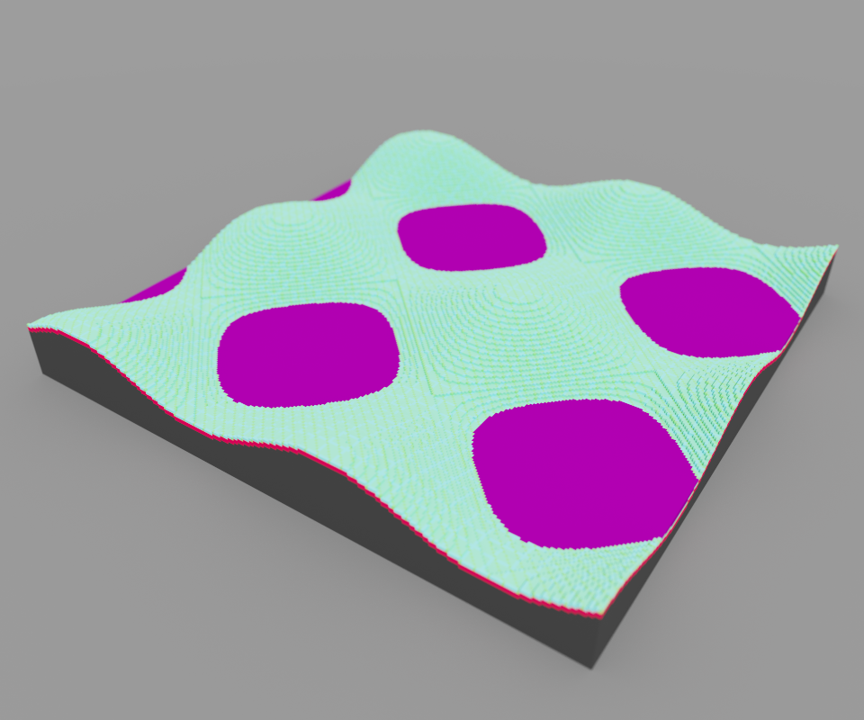
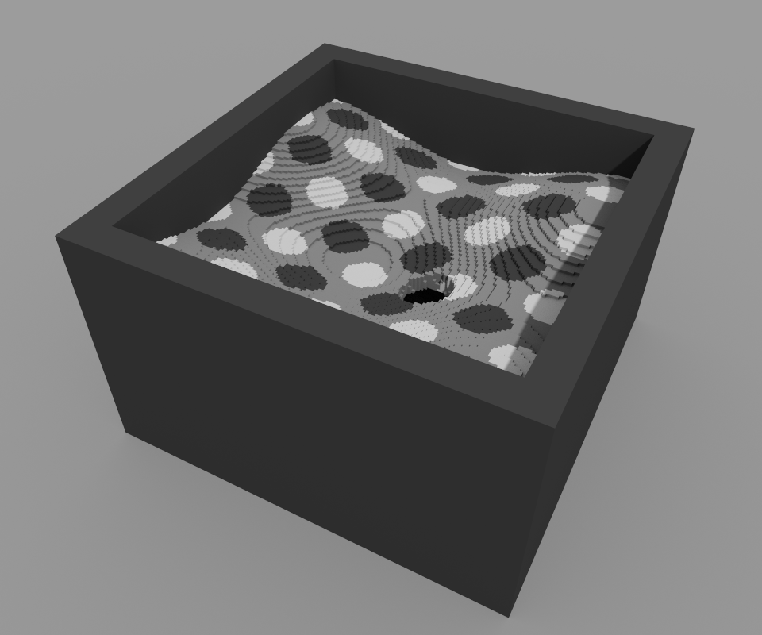
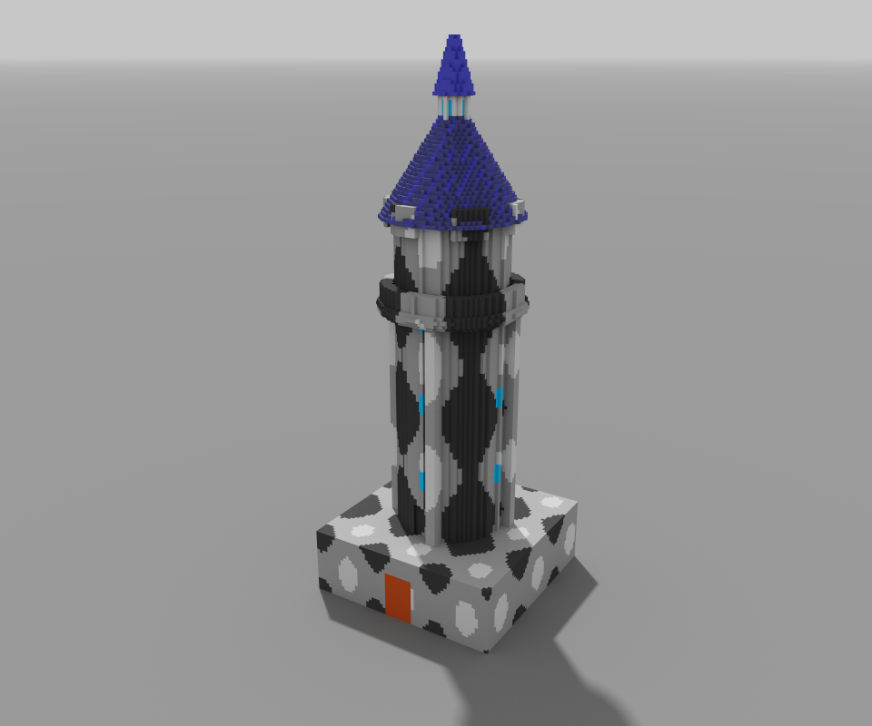
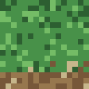
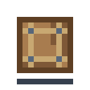
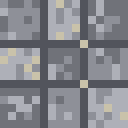

# PixelVox Factory

Turn object ideas into procedural voxel models and pixel-art assets with executable blueprints.

Part voxel generator, part AI imagination sandbox, and part human-AI co-creation playground, the project explores how a language model can translate knowledge about real-world objects into executable 3D voxel forms.

The core loop is simple: describe an idea, ask an AI agent to help turn it into a blueprint, generate the asset, inspect the result, and iterate.

The repository is intentionally small: each blueprint is a Python function that decides which voxel should exist at a given coordinate. That makes it useful both as a practical asset generator and as a readable experiment in procedural object construction.

## At A Glance

- describe an object and turn it into a voxel blueprint with AI assistance;
- generate a `.vox` model or palette-based PNG asset immediately through a GUI or CLI;
- inspect how the object reads in 3D or 2D and refine it through iteration;
- learn procedural voxel construction from a compact, readable codebase.

## Showcase

The repository includes curated voxel renders in [vox_preview_assets/README.md](vox_preview_assets/README.md) and generated pixel-art examples in the [images/](images) folder. README thumbnails stay intentionally small even when the source screenshots are much larger.

### Voxel Showcase

<table>
    <tr>
        <td align="center"><br><sub>House</sub></td>
        <td align="center"><br><sub>Realistic Tree</sub></td>
        <td align="center"><br><sub>Vehicle</sub></td>
    </tr>
    <tr>
        <td align="center"><br><sub>Hills</sub></td>
        <td align="center"><br><sub>Cave</sub></td>
        <td align="center"><br><sub>Tower</sub></td>
    </tr>
</table>

### Pixel-Art Showcase

<table>
    <tr>
        <td align="center"><br><sub>Gem Icon</sub></td>
        <td align="center"><br><sub>Potion Icon</sub></td>
        <td align="center"><br><sub>Grass Tile</sub></td>
        <td align="center"><br><sub>Crate Prop</sub></td>
    </tr>
    <tr>
        <td align="center"><br><sub>Bush Prop</sub></td>
        <td align="center"><br><sub>Stone Floor Tile</sub></td>
        <td align="center"><br><sub>Tiny Face Avatar</sub></td>
    </tr>
</table>

## What The Project Does

- Generates `.vox` files from Python blueprints.
- Generates palette-based PNG pixel art from Python blueprints.
- Can also emit quick PNG preview sheets with top, front, and side orthographic projections.
- Provides a simple Tkinter GUI for selecting and building models.
- Includes a curated voxel demo set with terrain, architecture, organic forms, props, and a rover-style vehicle.
- Includes a curated pixel-art demo set with icons, terrain tiles, props, and tiny avatar placeholders.
- Includes technique-oriented examples that teach primitive layering and negative-space carving.
- Exports voxel output into the `vox_models` folder and pixel-art output into the `images` folder.
- Documents how generated `.vox` files fit into a MagicaVoxel-centered workflow.
- Documents how the pixel-art blueprint path fits into quick 2D asset prototyping.
- Makes the model's object assumptions visible through inspectable 3D forms.
- Supports a fast describe-build-review loop that works well for playful experimentation.

## Why Someone Would Use It

- to prototype stylized voxel assets without hand-modeling everything first;
- to prototype tiny 2D game assets without hand-drawing every placeholder;
- to co-create object ideas with an AI agent and see the result quickly;
- to explore how language descriptions turn into structure, silhouette, and parts;
- to study small procedural blueprints without digging through a large engine.

## Typical Flow

1. describe an object, scene element, or prop in plain language;
2. ask an AI coding agent to turn that idea into a blueprint file for this repository;
3. build the result through the GUI or CLI;
4. open the generated `.vox` file in MagicaVoxel or inspect the generated PNG directly;
5. refine the prompt, blueprint, proportions, or details and generate again.

## Why This Repository Exists

Most voxel tools focus on manual editing. This repository explores a different workflow: describe a model as code, generate it quickly, adjust dimensions, and iterate.

It also started as a fan project for probing something more specific: what kind of shape, structure, and part relationships an AI model will externalize when asked to represent familiar real-world objects.

This is useful for:

- learning procedural generation fundamentals;
- quickly prototyping voxel assets for games and experiments;
- generating repeatable examples for MagicaVoxel pipelines;
- experimenting with geometric primitives in a compact codebase;
- observing how object knowledge turns into executable spatial form.

## Why This Is Fun

The project is designed around immediate feedback.

Instead of manually sculpting every voxel, you can:

1. describe an object or mood in plain language;
2. use an AI agent to turn that idea into blueprint logic;
3. generate a `.vox` file right away;
4. inspect what worked, what failed, and what the model seemed to "think" the object should look like;
5. refine the result together through another iteration.

That makes the repository useful not only for developers, but also for beginners, students, and curious creators who want a playful way to explore procedural art and AI-assisted making.

## What This Project Is Not

- not a full voxel engine;
- not a formal research benchmark for AI perception;
- not a replacement for manual modeling tools when precise authored control is the goal.

It is best treated as a compact procedural generator, a co-creation toy, and a readable sandbox for inspecting how object ideas become 3D forms.

## Project Layout

### Voxel Surface

- `vox_art/`: packaged voxel facade, blueprint utilities, CLI builders, and GUI launcher.
- `make_vox.bat`: Windows launcher for the voxel GUI.
- `vox_blueprints/`: procedural voxel model definitions.
- `vox_models/`: generated voxel output files and voxel preview PNGs.
- `vox_preview_assets/`: voxel screenshots and preview media intended for the README and release pages.
- `vox_engine/`: internal voxel engine implementation split into building, geometry, export, and preview rendering.

### Pixel Surface

- `pixel_art/`: packaged pixel-art entry points for the public 2D facade, CLI builders, GUI launcher, palette presets, and blueprint utilities.
- `pixel_blueprints/`: procedural 2D asset definitions.
- `images/`: generated pixel-art output files.
- `pixel_engine/`: internal engine implementation split into pixel building, geometry helpers, and PNG writing.
- `make_pixel_art.bat`: Windows launcher for the pixel-art GUI.

### Shared Docs And Support

- `templates/`: starting points for new blueprint contributions.
- `docs/architecture_overview.md`: short explanation of the public facades, workflow entry points, and internal engine split.
- `CONTRIBUTING.md`: contributor workflow and repository expectations.
- `todo.md`: publication and development roadmap.

Internal note: blueprint authors should import the stable public facade from `vox_art.engine`. The `vox_engine/` folder remains an internal implementation split used to keep rendering and export logic maintainable without leaking internal modules into blueprint code.

## Requirements

- Python 3.10+
- `py-vox-io`
- `Pillow`

Install dependencies:

```bash
pip install -r requirements.txt
```

## Quick Start

If you want the fastest voxel path, launch the GUI, pick a blueprint, build it, and open the result in MagicaVoxel.

### Option 1. GUI

Run:

```bash
python -m vox_art.gui_launcher
```

On Linux or macOS use:

```bash
python3 -m vox_art.gui_launcher
```

On Windows you can also use:

```bat
make_vox.bat
```

### Option 1b. Pixel-Art GUI

Launch the separate pixel-art launcher:

```bash
python -m pixel_art.gui_launcher
```

On Windows you can also use:

```bat
make_pixel_art.bat
```

The pixel GUI keeps its own window state, lets you browse `pixel_blueprints/`, export one PNG at a time, open the `images/` folder, and trigger batch showcase regeneration from the same window.

### Option 2. CLI

Build a blueprint with its default dimensions:

```bash
python -m vox_art.build_blueprint house
```

On Linux or macOS use:

```bash
python3 -m vox_art.build_blueprint house
```

Override dimensions explicitly:

```bash
python -m vox_art.build_blueprint rocket --width 64 --depth 64 --height 128
```

Build from a file path:

```bash
python -m vox_art.build_blueprint vox_blueprints/hills.py --width 256 --depth 256 --height 64
```

Write the generated `.vox` file into a custom output directory instead of `vox_models/`:

```bash
python -m vox_art.build_blueprint house --output-dir exports
```

Build a seeded deterministic variant when the blueprint supports it:

```bash
python -m vox_art.build_blueprint realistic_tree_vox --seed 7
```

Also save a quick PNG preview next to the `.vox` output:

```bash
python -m vox_art.build_blueprint house --preview-png
```

Generate only the PNG preview when you do not want to touch the `.vox` output at all:

```bash
python -m vox_art.build_blueprint house --preview-only --preview-mode isometric
```

For terrain-like models where a compact top-down image is more useful than a full contact sheet, use the dedicated top view mode:

```bash
python -m vox_art.build_blueprint hills --preview-only --preview-mode top --preview-scale 6
```

Switch the preview to an isometric render when you want something closer to a repository-facing showcase image:

```bash
python -m vox_art.build_blueprint house --preview-png --preview-mode isometric
```

Increase preview pixel scale when you want a larger image for README drafts or quick sharing:

```bash
python -m vox_art.build_blueprint rocket --preview-png --preview-scale 12
```

Suppress build progress and status output when you want cleaner batch logs:

```bash
python -m vox_art.build_blueprint house --preview-png --quiet
```

### Option 3. Pixel-Art CLI

Build a pixel blueprint with its default size:

```bash
python -m pixel_art.build_blueprint gem_icon
```

Build an inventory-style icon at a larger nearest-neighbor scale:

```bash
python -m pixel_art.build_blueprint potion_icon --scale 8
```

Build a deterministic tiny avatar variant:

```bash
python -m pixel_art.build_blueprint tiny_face_avatar --seed 7 --scale 6
```

Write pixel-art output into a custom directory:

```bash
python -m pixel_art.build_blueprint grass_tile --output-dir exports
```

Generated pixel-art PNG files are written to the `images` directory by default, or to the directory passed through `--output-dir`.

Generate the current pixel-art showcase set in one pass:

```bash
python -m pixel_art.build_demo_assets
```

Write the showcase set to a custom directory during review or release prep:

```bash
python -m pixel_art.build_demo_assets --output-dir exports
```

Large models automatically reduce the effective preview scale when needed so the generated PNG stays within a reasonable maximum image size instead of exploding into multi-thousand-pixel exports.

Generate the current showcase preview set into `vox_preview_assets/` in one pass:

```bash
python -m vox_art.build_preview_assets --preview-mode isometric --preview-scale 8
```

Generated `.vox` files are written to the `vox_models` directory by default, or to the directory passed through `--output-dir`.

When `--preview-png` is enabled, the PNG output is written as `vox_models/<name>-<mode>.png`. Orthographic mode produces a top/front/side contact sheet, `top` produces a compact top-down render, isometric mode produces a shaded voxel render, and `both` stacks the orthographic and isometric views vertically. Preview generation now auto-clamps the effective scale to keep the final image within a reasonable maximum size for quick sharing and GUI usage.

When `--preview-only` is enabled, the command skips `.vox` export and writes only the requested PNG preview.

When `--quiet` is enabled, the command suppresses progress and status output while still writing the requested files.

At the Python API level, the same behavior is controlled through the `progress=False` argument on `save_as_vox(...)`, `save_preview_png(...)`, and `save_outputs(...)`.

Exports now embed a baseline palette aligned with MagicaVoxel's default `pal0`, so the palette indices used in blueprints stay consistent when the `.vox` file is opened elsewhere.

If you are working with an AI coding agent, a practical starting request is:

```text
Create a new blueprint for this repository that generates a small stylized voxel windmill.
Follow the existing blueprint contract, keep the code readable, and make it buildable through `python -m vox_art.build_blueprint`.
```

In the GUI, width, depth, and height overrides are applied only for the current build. Blueprint source files are no longer rewritten when a user changes dimensions.

Before a build starts, the GUI validates that the selected blueprint can be imported and that it defines `make_model(...)`. If the blueprint has a syntax or import problem, the user gets a dialog instead of a silent failure.

The GUI also lets the user override the output file name without renaming the blueprint itself.

For blueprints that support seeded variants, the GUI also accepts an optional integer seed.

The GUI can also generate preview images without exporting a `.vox` file by enabling the preview-only option in Build Settings.

After at least one successful launch, the GUI enables a button for repeating the last build with the same blueprint, dimensions, and output name.

If the `blueprints` folder is missing, the GUI shows a clear error. If the `models` folder does not exist yet, the GUI explains that it will appear after the first successful build.

## Blueprint Format

This repository now supports two blueprint families.

### Voxel Blueprints

Each blueprint exposes a function with this shape:

```python
def make_model(x, y, z, W, D, H):
    ...
    return color_index_or_zero
```

Seed-aware blueprints may optionally accept a seventh argument:

```python
def make_model(x, y, z, W, D, H, seed=None):
    ...
    return color_index_or_zero
```

The callback is invoked once per coordinate in the output volume and must be side-effect safe enough to run many times during one build.

Optional defaults can be declared as module-level constants:

```python
DEFAULT_W = 64
DEFAULT_D = 64
DEFAULT_H = 64
```

Optional metadata can also be declared for GUI and tooling integration:

```python
BLUEPRINT_DISPLAY_NAME = 'Realistic Tree'
BLUEPRINT_DESCRIPTION = 'An expressive showcase tree with a layered canopy.'
RECOMMENDED_W = 96
RECOMMENDED_D = 96
RECOMMENDED_H = 128
BLUEPRINT_PALETTE_OVERRIDES = {
    45: (210, 205, 170),
    219: (150, 24, 24),
}
```

If the recommended dimensions are omitted, the GUI falls back to `DEFAULT_W`, `DEFAULT_D`, and `DEFAULT_H`.

Palette overrides are optional. When omitted, the exporter uses a baseline palette aligned with MagicaVoxel's default `pal0`. When present, the blueprint overrides only the specified palette slots and still inherits the rest of that baseline palette.

This matters because blueprint colors are palette indices, not free RGB values. In this repository, those indices are intended to be read against the default zero palette of MagicaVoxel unless a blueprint explicitly overrides specific slots.

If you inspect `pal0.png` directly, note that MagicaVoxel slot numbering is effectively one-based relative to the horizontal strip image. In practice, blueprint slot `N` corresponds to the `(N - 1)` color position in the `pal0.png` strip.

`0` means "no voxel". Any non-zero integer is treated as a palette index.

For `save_as_vox(...)`, the current runtime contract is:

- `W`, `D`, and `H` must be positive integers;
- `fill_func` must be callable;
- `fill_func` is called as `fill_func(x, y, z, W, D, H)` for every voxel candidate;
- blueprints may optionally expose `make_model(x, y, z, W, D, H, seed=None)` for deterministic variants;
- optional metadata fields must be strings for names and descriptions, and positive integers for recommended dimensions;
- optional `BLUEPRINT_PALETTE_OVERRIDES` must be a dictionary mapping palette indices to RGB or RGBA tuples;
- `0`, `None`, and `False` mean "no voxel";
- positive integers are used as palette indices;
- other truthy non-integer values are normalized to palette index `1` for compatibility;
- negative integer palette indices are rejected.

Geometry helper contract:

- shape helpers are intended for valid geometric parameters, not silent auto-correction;
- negative radii are rejected;
- `is_cone(...)` requires `height > 0` and `radius >= 0`;
- `is_sphere(...)`, `is_cylinder(...)`, `is_capsule(...)`, and `is_torus(...)` require non-negative radius values.

### Pixel Blueprints

Pixel blueprints expose a 2D variant of the same idea:

```python
def make_image(x, y, W, H):
    ...
    return color_index_or_zero
```

Seed-aware pixel blueprints may optionally accept:

```python
def make_image(x, y, W, H, seed=None):
    ...
    return color_index_or_zero
```

`0`, `None`, and `False` mean transparent pixel. Positive integers are treated as palette indices.

Pixel blueprint metadata mirrors the voxel side with `DEFAULT_W`, `DEFAULT_H`, `BLUEPRINT_DISPLAY_NAME`, `BLUEPRINT_DESCRIPTION`, optional recommended dimensions, and optional `BLUEPRINT_PALETTE_OVERRIDES`.

For a dedicated walkthrough, see [docs/pixel_blueprints.md](docs/pixel_blueprints.md).

## Current Examples

- `hills`: a procedural terrain surface from sine and cosine waves.
- `realistic_tree_vox`: a more expressive organic showcase with a layered canopy and branch structure.
- `rocket`: a stylized prop built from a capsule, cone, and simple proportions.
- `tower`: a vertical architectural showcase with a plinth, ring balcony, battlements, and a spire.
- `cave`: a negative-space showcase with carved chambers, tunnels, and damp cave floor variation.
- `sci_fi_prop`: a hard-surface reactor-style prop with glowing energy elements and modular forms.
- `vehicle`: a rover-style vehicle showcase with wheel cutouts, layered body panels, and a compact cockpit.
- `primitive_layers`: a teaching example for building one form from stacked primitives.
- `negative_space_arch`: a teaching example for carving silhouette and interior voids from a larger mass.
- `gem_icon`: a minimal inventory-style icon and the first 2D smoke blueprint.
- `potion_icon`: a seeded bottle icon suitable for UI or loot placeholders.
- `grass_tile`: a simple terrain tile for top-down or prototype map work.
- `crate_prop`: a compact crate prop for 2D prototype scenes.
- `bush_prop`: a compact foliage prop for quick scene dressing.
- `stone_floor_tile`: a seeded floor tile for dungeon or ruin blockouts.
- `tiny_face_avatar`: a tiny seeded face placeholder for dialogue or NPC use.

The demo set is intentionally small. Some blueprints are showcase pieces, while others are intentionally technique-oriented learning examples.

## Current Limitations

- The automated test suite is intentionally minimal and focuses on stable contracts.
- The voxel and pixel-art paths currently use separate GUI launchers.
- The pixel-art path still remains CLI-first internally, and the dedicated GUI drives those existing CLI entry points.

## Preview Assets

Repository-facing screenshots and GIFs belong in [vox_preview_assets/README.md](vox_preview_assets/README.md).
That folder is reserved for curated documentation media, not for general generated output.

## Pre-Release Checklist

Before the first public tag, the repository should ideally have:

- 3-5 curated screenshots or short GIFs in `vox_preview_assets/` and reflected in the README;
- one short release note entry based on [CHANGELOG.md](CHANGELOG.md);
- a quick smoke pass on GUI launch, CLI build, and MagicaVoxel opening for the main showcase models;
- a final README skim to ensure the screenshot set matches the current demo set.

## Workflow Notes

If you want to understand where these generated files fit in a practical asset pipeline, see [docs/magica_vox_workflow.md](docs/magica_vox_workflow.md).

If you want to create a new blueprint from scratch, start with [docs/first_blueprint.md](docs/first_blueprint.md).

If you want to create or inspect a pixel-art blueprint, see [docs/pixel_blueprints.md](docs/pixel_blueprints.md).

## Testing

Run the minimal regression suite with the Python standard library:

```bash
python -m unittest discover -s tests -v
```

On Linux or macOS use:

```bash
python3 -m unittest discover -s tests -v
```

The current tests cover geometry helpers, blueprint loading, `.vox` export smoke behavior, pixel-art PNG export behavior, and validation contracts.

## Contributing

See `CONTRIBUTING.md` for contribution rules, [templates/vox_blueprint_template.py](templates/vox_blueprint_template.py) for voxel blueprints, and [templates/pixel_blueprint_template.py](templates/pixel_blueprint_template.py) for pixel blueprints.

## Publication Goal

The repository is best positioned as a small open-source procedural voxel and pixel-art generator, educational codebase, and playful AI object-imagination experiment, not as a full engine or a formal research framework.

## Packaging Decision

For the first public release, this project stays a script collection rather than becoming an installable package.

This is intentional:

- the current value is in simple blueprint iteration, not in library-style reuse;
- GUI and CLI entry points already cover the main workflows without packaging overhead;
- keeping the repository flat makes it easier for new contributors to read and modify;
- packaging should happen only if external usage creates real pressure for stable import paths and versioned APIs.

The project can move to a package layout later if one or more of these become important:

- users want `pip install` distribution;
- external projects start importing engine helpers as a dependency;
- the public API grows beyond the current lightweight scripts.

## Roadmap

See `todo.md` for a detailed publication and development roadmap.

## Changelog

See [CHANGELOG.md](CHANGELOG.md) for the current release-preparation history.

## License

MIT. See the `LICENSE` file.